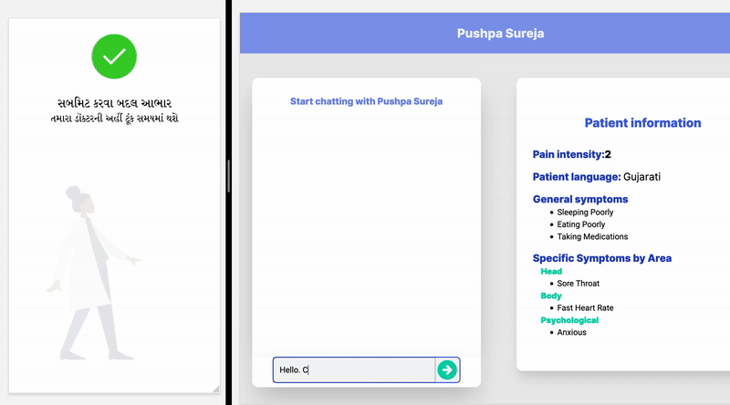
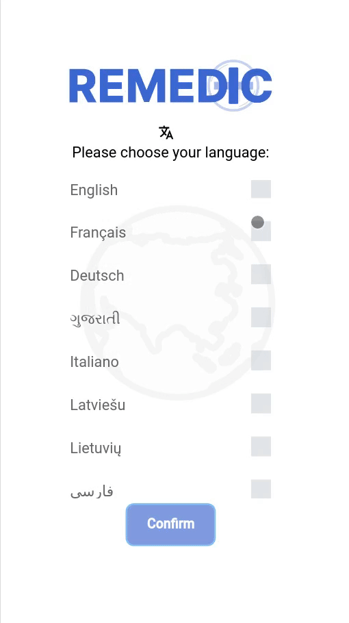
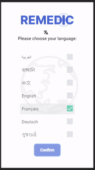
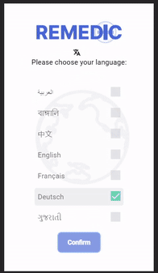
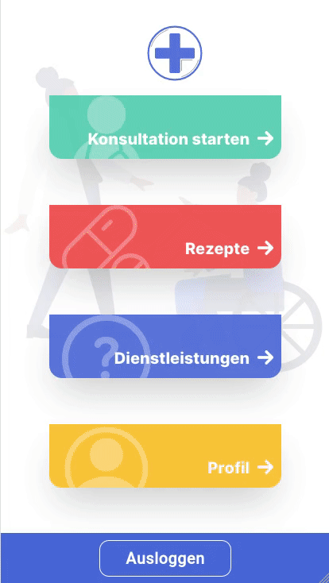
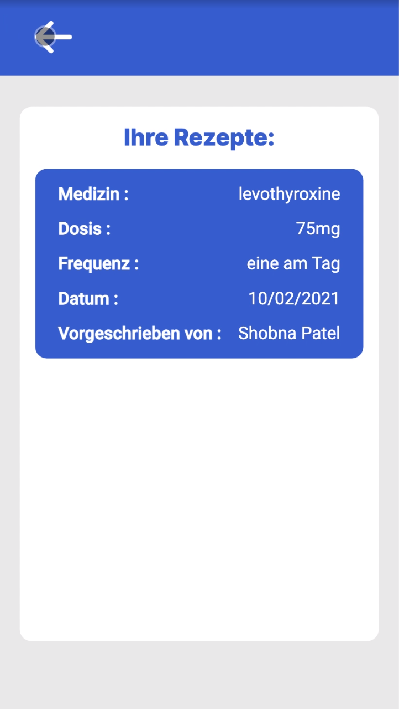
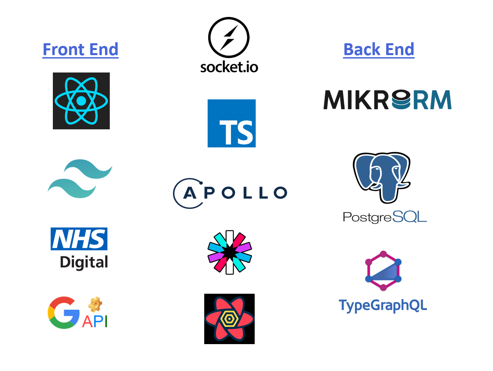

# **REMEDIC**
Medical Live Consultation Translation App

## **Table of Contents**
* [Introduction](#introduction)
* [Features and services](#features)
* [Tech stack](#tech)
* [Get started](#getstarted)

<h2 style="font-size: 2rem; font-weight: bold; color:#4766D7">Introduction</h2>

Remedic is a response to a call from the NHS for software that allows for high quality in-person patient-doctor consultation across a language-barrier without using a translator.

Internal studies by the NHS show a loss in quality of health and health-care provision where english is not the patients first language, despite spending over 20 million pounds a year on in-person translators. Remedic provides a solution by offering real-time translation at the time of consultation, as well as other services.

<h2 style="font-size: 2rem; font-weight: bold; color:#4766D7">Features and Services</h2>

- Select one of our 24 supported languages.

    
    
    

 

- Share translated details of your symptoms with your doctor ahead of your consultation.

  

 

- Share live-translated messages with your doctor, including having messages read to you via a text-to-speech option
 

- Locate nearby health service providers

  

 

- Easily get an explanation of medical terms in your language

  

 

- Receive and keep track of prescriptions

  

 

<h2 style="font-size: 2rem; font-weight: bold; color:#4766D7">Tech stack</h2>

  

 ### Front end:
- React - https://reactjs.org/
- Tailwind CSS - https://tailwindcss.com/
- NHS API - https://digital.nhs.uk/
- Google APIs ([Google Translate](https://cloud.google.com/translate) + [Google Text-to-Speech](https://cloud.google.com/text-to-speech))
- React Query - https://react-query.tanstack.com/
### Back end:
- Apollo server - https://www.apollographql.com
- MikroORM - https://mikro-orm.io/
- PostgreSQL - https://www.postgresql.org/docs/
- TypeGraphQL - https://typegraphql.com/

### Services:
- TypeScript - https://www.typescriptlang.org/
- SocketIO - https://socket.io/
- JSON Web Tokens - https://jwt.io/

<h2 style="font-size: 2rem; font-weight: bold; color:#4766D7">Get started</h2>

- Fork the repository and clone it on your local machine
- Install the dependencies by running `npm i` in both client and server directories
- Create a local .env file for both client and server and fill with your local details (database, API keys, ports...) following the .envcopy fields
- Build the server by running `npm run build` and start with `npm start`
- Start the client by running `npm start`

Note: this is assuming that you have PostgreSQL already installed and running on your computer, as well as Node JS and npm