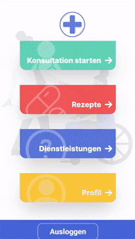

# **REMEDIC**
Medical Live Consultation Translation App

## **Table of Contents**
* [Introduction](#introduction)
* [Features and services](#features)

<h2 style="font-size: 2rem; font-weight: bold; color:#4766D7">Introduction</h2>

Remedic is a response to a call from the NHS for software that allows for high quality in-person patient-doctor consultation across a language-barrier without using a translator.

Internal studies by the NHS show a loss in quality of health and health-care provision where english is not the patients first language, despite spending over 20 million pounds a year on in-person translators. Remedic provides a solution by offering real-time translation at the time of consultation, as well as other services.

<h2 style="font-size: 2rem; font-weight: bold; color:#4766D7">Features and Services</h2>

- Select one of our 24 supported languages.

    
    
    

- Share translated details of your symptoms with the doctor ahead of your consultation.

  

- Locate nearby health service providers

  

- Easily translate medical terms

- Receive and keep track of prescriptions

-